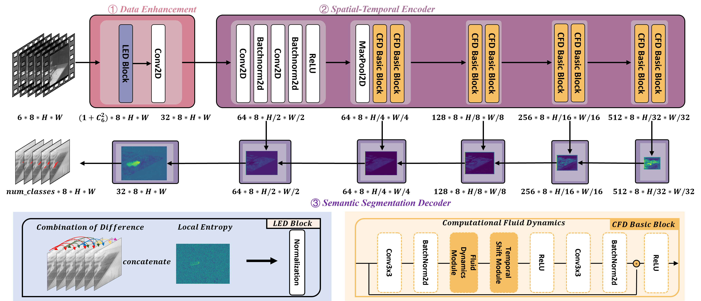
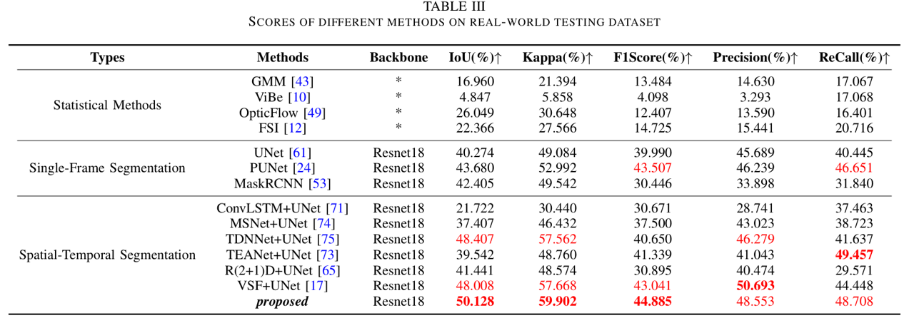
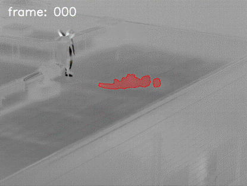
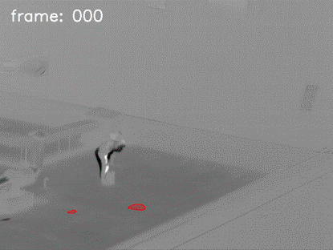

# CFDNet
**CFDNet: Coupling Computational Fluid Dynamics with Convolutional Neural Networks for Gas Detection using Thermal Infrared Multispectral Video**

### 1. Model

### 2. Results

### 3. Inference Demo

|SO₂ (Sulfur Dioxide)|CH₄ (Methane)|NH₃ (Ammonia)|
|:---:|:---:|:---:|
|
  <tr>
    <th>SO₂ (Sulfur Dioxide)</th>
    <th>CH₄ (Methane)</th>
    <th>NH₃ (Ammonia)</th>
  </tr>
  <tr>
    <td></td>
    <td></td>
    <td></td>
  </tr>
</table>

> **Citation:**
> 
> @ARTICLE{11240221,
> author={Xiong, Haiyang and Cao, Liqin and Wang, Du and Du, Yuhao and Zhong, Yanfei and Wang, Shijin},
> journal={IEEE Transactions on Geoscience and Remote Sensing},
> title={CFDNet: Coupling Computational Fluid Dynamics With Convolutional Neural Networks for Gas Detection Using Thermal Infrared Multispectral Video},
> year={2025},
> volume={63},
> number={},
> pages={1-17},
> keywords={Feature extraction;Videos;Deep learning;Object detection;Imaging;Shape;Computational fluid dynamics;Optical flow;Entropy;Cameras;Gas detection;infrared multispectral video imaging;spatial–temporal feature extraction},
> doi={10.1109/TGRS.2025.3631727}}
